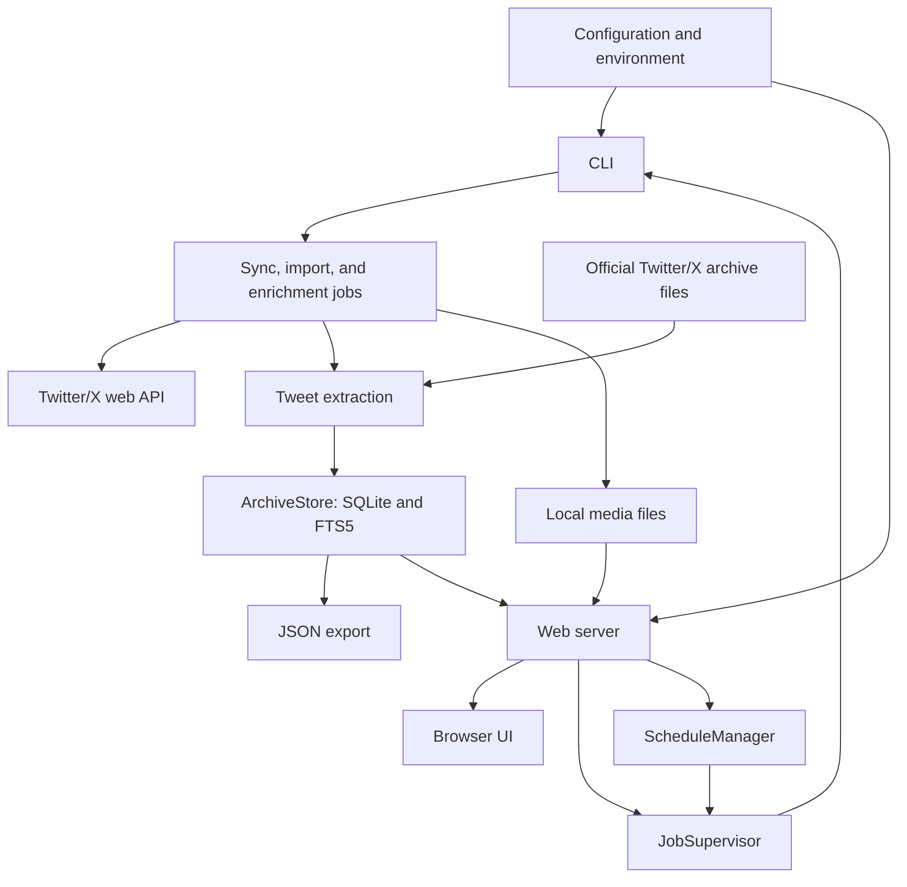

# Architecture

[Development guide](README.md) · [Storage](storage.md) ·
[Client and Sync](client-and-sync.md) · [Web and Jobs](web-and-jobs.md)

tweetnook is a local-first Python application with one canonical archive and
two user interfaces. The CLI owns long-running command semantics. The Web
service exposes read APIs, launches the same CLI as supervised subprocesses for
long jobs, and performs a smaller set of settings/tag mutations directly.

## Component flow

The CLI coordinates long jobs. They fetch or import source data, extract shared
tweet records, and persist them through `ArchiveStore`. The web server reads the
same store and launches CLI workers through `JobSupervisor`.

Optional tagging sends selected tweet data and media to Google Gemini, then saves
tags and local usage records. OpenRouter supplies pricing metadata for cost
estimates.

## Package boundaries

### Interface/orchestration

- `cli.py` defines Typer commands, shared rendering, error-to-exit handling, and
  command wiring.
- `cli_web.py` manages detached Web startup, PID/port detection, stop/restart,
  and password setup.
- `pipeline.py`, `activity_history.py`, `jobs.py`, and `locking.py` provide
  status, durable run records, store ownership, and process serialization.
- `job_supervisor.py` launches Web/scheduled CLI subprocesses.
- `scheduler.py` computes and persists due times while Web is alive.

### Source acquisition

- `auth/` resolves only explicit config/environment credentials.
- `query_ids/` discovers/caches Web GraphQL operation IDs.
- `client/` builds requests, classifies HTTP errors, paces/retries, and parses
  timeline/detail payloads.
- `sync.py` implements preflight, head/backfill modes, page persistence, and
  follow-up orchestration.
- `archive_import.py` ingests official Twitter/X exports from local files.

### Normalization and storage

- `extractor.py` converts raw GraphQL/archive-shaped data into a canonical graph.
- `storage/backend.py` owns schema, transactions, merge provenance, queues,
  hydration, export rows, tags, stats helpers, and maintenance.
- `storage/migrate.py` is a one-way compatibility importer that reads old
  LanceDB data and writes current SQLite rows.

### Enrichment/search/reporting

- `threads.py`, `articles.py`, `media.py`, `unfurl.py`, and `resurrection.py`
  enrich local state through detail/network work.
- `search.py` parses and executes FTS/structured queries.
- `stats/` assembles typed reports and CLI output.
- `export/` writes hydrated JSON.

### Optional AI

- `automated_tagging.py` handles optional dependency/model discovery.
- `tagging.py` orchestrates provider requests and persistence.
- `tagging_prompts.py` owns prompt policy.
- `gemini_accounting.py`, `gemini_pricing.py`, and `rpd.py` provide local usage,
  estimate, Search, and Free-quota controls.

### Web

- `web/server.py` owns application lifespan and route/static registration.
- `web/deps.py` owns HTTP Basic verification.
- `web/availability.py` canonicalizes presentation state.
- `web/stats_cache.py` provides five-minute stale-while-revalidate snapshots.
- `web/routes/` exposes activity, setup, config, stats, tags, tweets, avatars,
  storage, and optional-tagging APIs.
- `web/index.html` plus static CSS/JS is a server-delivered Alpine.js UI.

## Core data model

The database uses one wide `archive` table with a `row_key` primary key and a
`record_type` discriminator. It deliberately separates:

- a tweet's membership in bookmark/like/authored collections (`tweet` rows);
- the account-global canonical object (`tweet_object`);
- relationships, media, URLs/references, articles, and tags;
- raw captures, cursor state, owner/metadata, and import manifests.

That separation allows one tweet to belong to multiple collections while sharing
canonical detail. It also preserves sparse imported likes until live/detail data
fills them.

Contentless FTS5 indexes membership-row author/text fields and is maintained by
triggers. Structured search joins or tweet filters normalized secondary state.
There is no embedding index.

## Ownership and provenance

The archive owner is a Twitter/X account identifier stored as SQLite text. Twitter/X supplies
numeric IDs in normal use, but the implementation validates only nonempty text.
Preflight/import reject a different configured/archive owner when an identifier
is available for comparison.

Rows carry source/provenance. Merge rules prefer nonempty same-source incoming
data and richer `live_graphql` values over `x_archive`, while archive data can
fill nulls. Live data can clear stale unavailable lifecycle state and mark
recovery.

Raw captures preserve the source response needed for auditing, rehydration, or
future extraction changes. Live captures use UUID keys; archive captures use
deterministic hashes for rerun idempotence.

## Transaction and concurrency boundaries

Two POSIX `flock` files have different scopes:

- `command.lock` — held by a pipeline lifecycle, including non-write stages;
- `sync.lock` — held around archive writer/schema/maintenance jobs.

SQLite also serializes its own transactions, but the process locks provide a
clear user-facing single-writer policy and job conflict reporting.

Timeline page persistence is the central atomic unit: raw capture, membership,
canonical/secondary graph, and sync cursor are buffered and merged in one
transaction. A multi-page, multi-collection, import, or follow-up run is not one
global transaction; completed checkpoints survive later failure.

Read-only stats/view/search/export/check commands on a current schema do not
acquire `sync.lock`. Opening an older schema is the exception: migration takes
the lock. WAL permits concurrent reads, so they can observe a consistent SQLite
snapshot while a writer proceeds, but not necessarily the final run state.

## Lifecycle and error boundaries

Domain errors in `exceptions.py` distinguish local config/auth, expired auth,
rate limiting, stale query IDs, feature drift, response/storage/import/search/
scheduler failures, and focal absence. CLI boundaries commonly map local config
to exit `1` and project/API errors to `2`, but several raw exceptions still
escape.

Pipeline steps distinguish:

- core sync failure, which determines the command result;
- recoverable follow-up issues, which are recorded without rolling back core
  pages;
- interruption, which finalizes activity state and leaves checkpoints durable.

Web routes translate route validation into HTTP status codes, but several
generic handlers include raw exception text. Treat Web as a local administration
surface, not a hardened public API.

## Web/worker relationship

The Web process opens a shared read/write `ArchiveStore` for route operations and
starts a `JobSupervisor` plus `ScheduleManager`. Mutating long jobs run in new
process groups as `python -m tweetnook ...`, inheriting resolved XDG roots and
an activity origin/run ID. Lightweight tag CRUD and configuration/auth/schedule/
AI-settings updates execute in Web routes instead of supervised CLI jobs; they
do not acquire `ProcessLock`/`sync.lock` and rely on the shared SQLite/config
behavior. They can therefore race a CLI archive/config writer and are not part
of the single-long-job guarantee.

This avoids reimplementing CLI behavior but creates two operational facts:

- Web shutdown stops its active managed worker gracefully before closing storage;
- a Web restart stops managed work and reconciles durable Setup state on startup.

Activity status files and process existence bridge CLI/Web visibility.

## Trust boundaries

### Secrets to Twitter/X

`auth_token` and `ct0` are attached as `.x.com` cookies plus CSRF/header state.
They come only from config/environment. Raw responses are persisted locally.

### Stored URLs to arbitrary hosts

Media, URL unfurl, and avatar code follows captured URLs. None has a private-
network/host allowlist, making trusted archive/database content an important
assumption. General response-size defenses are incomplete, and the media
downloader has no download-size ceiling.

### Browser to local server/filesystem

APIs/root/media normally use Basic authentication. The Web `/media` serving
route resolves its base/target and rejects traversal, symlink escape, and non-
files. That containment does **not** apply generally to archive import, media
download, or tagging paths. Static code assets are public. The authenticated
activity import route can reference arbitrary server-readable ZIP/directory
paths and request regeneration, so it is a trusted-local-admin boundary.

### Archive content to Gemini

Automated tagging sends selected text/context/tags/media to Google. Paid
requests set `store=false`; uploaded remote files are deleted best-effort and can
remain under provider retention when cleanup fails. Search Grounding has its own
provider retention terms. The API key is masked in normal config responses and
selected errors, not through a universal log scrubber.

## Known architectural constraints

- POSIX-only locking and some POSIX date formatting.
- One account per database.
- No official Twitter/X API compatibility layer.
- No browser login/profile ingestion.
- No comprehensive SSRF, Web CSRF/origin, TLS, rate-limit, security-header, or
  multi-user authorization layer.
- No generic backup/restore service.
- No HTML export or JSON re-import.
- No semantic/vector search; `_embed_new_tweets()` is a no-op remnant and one
  error message still mentions a nonexistent `embed` command.
- Web index-repair startup calls are currently no-ops; schema creation/migration
  must have created FTS/indexes.
